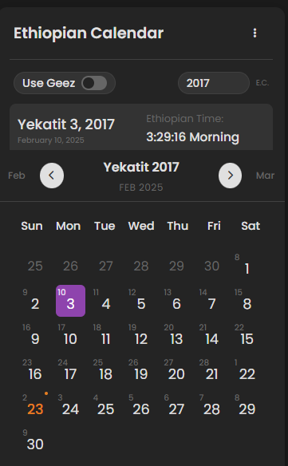
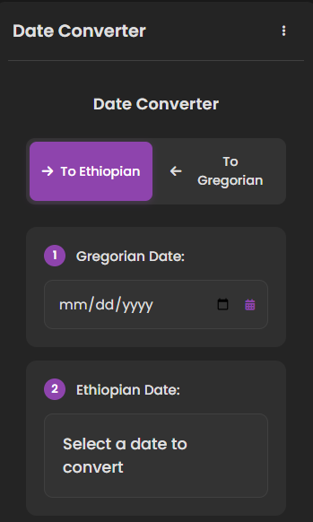
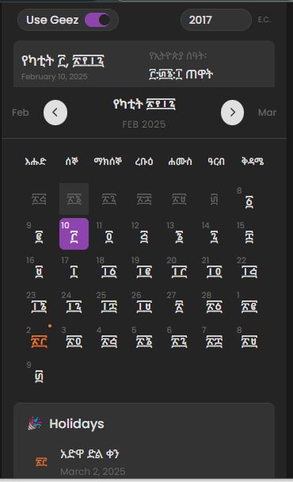
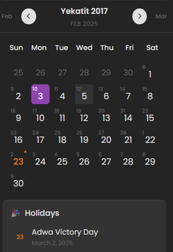

# Ethiopian Calendar Chrome Extension 🗓️

A feature-rich Chrome extension that provides an Ethiopian calendar with date conversion, holiday tracking, and time display functionality. This extension seamlessly integrates Ethiopian date formats with the Gregorian calendar system while supporting both Amharic and Latin scripts.

## Screenshots 📸

View Screenshots

### Calendar View 

*Dark mode interface for comfortable viewing at night*

### Date Converter

*Bi-directional date conversion between Ethiopian and Gregorian calendars*

### Language Toggle

*Switch between Geez (Amharic) and Latin scripts*

### Holiday Display

*View Ethiopian holidays and celebrations*

## Features ✨

### Calendar View
- **Interactive Calendar Display**: Navigate through Ethiopian months and years
- **Dual Script Support**: Toggle between Geez (Amharic) and Latin scripts
- **Holiday Tracking**: Displays Ethiopian holidays, including:
  - Fixed holidays
  - Easter-related holidays (dynamically calculated)
  - Islamic holidays (with lunar calendar integration)
- **Real-time Ethiopian Time**: Shows current time in Ethiopian format

### Date Converter
- **Bi-directional Conversion**: 
  - Ethiopian to Gregorian dates
  - Gregorian to Ethiopian dates
- **User-friendly Interface**: Simple date selection and instant conversion
- **Accurate Calculations**: Handles leap years and complex calendar rules

### Theme Support
- Light and dark mode support
- Follows system preferences
- Smooth theme transitions

## Installation 🚀

1. Download or clone this repository
2. Open Chrome and navigate to `chrome://extensions/`
3. Enable "Developer mode" in the top right
4. Click "Load unpacked" and select the extension directory
5. The Ethiopian Calendar icon should appear in your Chrome toolbar

## Usage 📖

### Calendar Navigation
- Use arrow buttons to move between months
- Select years from the dropdown menu
- Toggle between Geez and Latin scripts using the checkbox

### Date Conversion
1. Click the converter tab in the menu
2. Select conversion direction (To Ethiopian/To Gregorian)
3. Input the date you want to convert
4. View the converted date instantly

## Technical Details 🔧

### Files Structure
- `manifest.json`: Extension configuration
- `index.html`: Main popup interface
- `style.css`: Styling and themes
- `script.js`: Main application logic
- `converter.js`: Date conversion utilities
- `utils.js`: Helper functions
- `config.js`: Calendar configuration and constants

### Technologies Used
- JavaScript (ES6+)
- CSS3 with CSS Variables
- HTML5
- Font Awesome icons

## Contributing 🤝

Contributions are welcome! Feel free to:
1. Fork the repository
2. Create a feature branch
3. Submit a pull request

## Should You Put This on GitHub? 👍

Yes, this project would be valuable on GitHub because:
1. **Unique Functionality**: There aren't many Ethiopian calendar extensions with this level of features
2. **Educational Value**: Demonstrates complex calendar calculations and conversions
3. **Community Benefit**: Useful for Ethiopian developers and users
4. **Code Quality**: Well-structured and documented code
5. **Potential for Collaboration**: Others can contribute improvements and translations

## Future Improvements 🚀
- Add more holiday categories
- Implement calendar event management
- Add support for more Ethiopian calendar features
- Enhance accessibility features
- Add unit tests
- Create a web version

## Credits
Created by Yonas Kumelachew